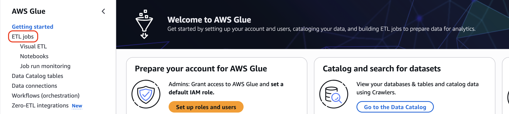
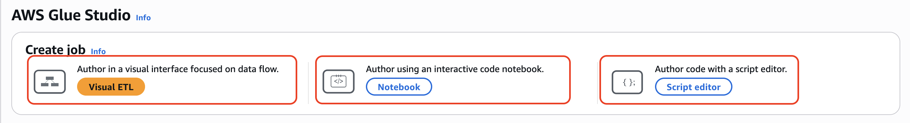
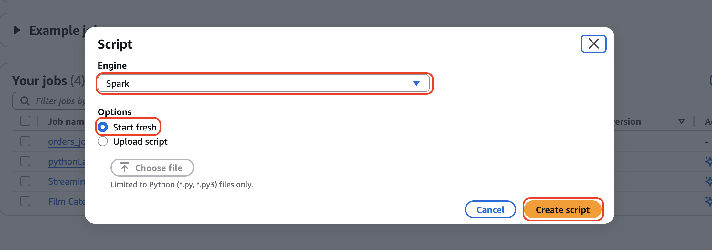
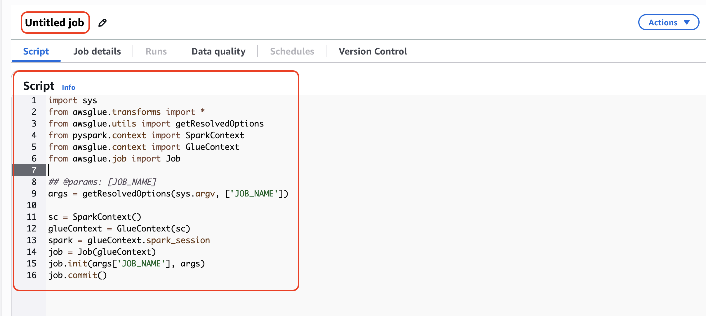
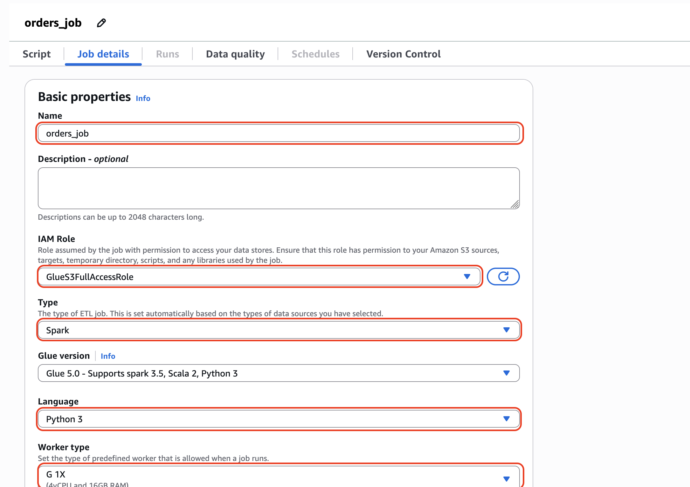

# AWS Glue ETL Jobs: Transform Your Data at Scale

Even though the AWS Glue Crawler creates your Data Catalog automatically, some projects require a transformation step. This is where AWS Glue ETL Jobs come in. Glue ETL allows you to clean, transform, standardize, and enrich your raw datasets using PySpark at scale.

In this section, we will build a simple but production-ready Glue ETL script that:

- Reads data from the raw S3 bucket using the Data Catalog
- Performs basic cleaning (renaming, casting types, dropping fields)
- Converts it into a structured format (Parquet recommended)
- Writes the output into the Clean Zone in S3

This optional ETL job is perfect for Medium readers who want to go beyond cataloguing into real data engineering.

## 🏗 Step 1: Create a Glue Job

1. Open AWS Glue Console → Click on **ETL Jobs**




 You can start the job creation process from a blank canvas, notebook or script editor in the following ways.



**Visual ETL**
Choose Visual ETL to start with an empty canvas. Use this option when you want to create a job that has multiple data sources or if you want to explore the available data sources.

**Author using an interactive code notebook**
Choose Notebook to start with a blank Notebook to create jobs in Python using the Spark or Ray kernel.

**Author code with a script editor**
    Choose Script editor to start with only Python boilerplate text added to your job script, or to upload your own script. If you choose to upload your own script, you can select only Python files or files with the extension .scala from your local file system. Use this option if you have a job script you want to import into AWS Glue Studio, or you prefer writing your own ETL job 
In this demostration, I will choose the **Script editor**

1. Click **Script editor** and select **Spark** as the engine and **Start fresh** as the option and click **Create script**




2. In the **Script editor** replace the default code with the code below


   

## 💻 Glue ETL Job Script 


```python
#Imports Python's system module to access command-line arguments.
import sys

#Imports all AWS Glue transformation functions (though none are explicitly used in this script).
from awsglue.transforms import *

#Imports utility to parse job parameters passed to the Glue job.
from awsglue.utils import getResolvedOptions

#Imports GlueContext, which wraps SparkContext and provides Glue-specific functionality.
from awsglue.context import GlueContext

#Imports Job class for managing Glue job lifecycle and bookmarking.
from awsglue.job import Job

#Imports DynamicFrame, Glue's data structure that handles schema variations better than Spark DataFrames.
from awsglue.dynamicframe import DynamicFrame

#Imports SparkContext, the entry point for Spark functionality.
from pyspark.context import SparkContext

#Imports PySpark SQL functions for data transformations.
from pyspark.sql.functions import (
    col, to_date, trim, upper, when, year, month
)

# ---------------------------------------------------------------------------------
# Initialize Glue Job
# ---------------------------------------------------------------------------------
args = getResolvedOptions(sys.argv, ["JOB_NAME"])
sc = SparkContext()
glueContext = GlueContext(sc)
spark = glueContext.spark_session
job = Job(glueContext)
job.init(args["JOB_NAME"], args)

# ---------------------------------------------------------------------------------
# Read raw CSV data from S3 using the Glue Data Catalog table
# ---------------------------------------------------------------------------------
raw_dyf = glueContext.create_dynamic_frame.from_catalog(
    database="orders_db",
    table_name="medallion_orders_2025_12_17",   # update with your catalog table name
    transformation_ctx="raw_dyf"
)

# ---------------------------------------------------------------------------------
# Column Standardization
# ---------------------------------------------------------------------------------
df = raw_dyf.toDF()

# Standardize column names (Spark-friendly)
df = df.toDF(*[c.lower().replace(" ", "_") for c in df.columns])

# ---------------------------------------------------------------------------------
# Clean & Transform Data
# ---------------------------------------------------------------------------------

# Trim whitespace
for column in df.columns:
    df = df.withColumn(column, trim(col(column)))

# Convert datatypes
df = (
    df.withColumn("order_date", to_date(col("order_date"), "yyyy-MM-dd"))
      .withColumn("order_id", col("order_id").cast("int"))
)

# Remove invalid rows
df = df.filter(col("order_id").isNotNull() & col("customer_id").isNotNull())

# Fix negative values (replace with null or filter)
df = df.withColumn("total_amount", when(col("total_amount") < 0, None).otherwise(col("total_amount")))

# Create derived columns
df = df.withColumn("total_price_in_USD", col("total_amount") * 13)

# Remove duplicates
df = df.dropDuplicates()

# ---------------------------------------------------------------------------------
# Convert back to DynamicFrame
# ---------------------------------------------------------------------------------
final_dyf = DynamicFrame.fromDF(df, glueContext, "final_dyf")

# ---------------------------------------------------------------------------------
# Write to Clean S3 Zone (Partitioned)
# ---------------------------------------------------------------------------------
output_path = "s3://medallion-orders-2025-12-17/clean/orders/"  # update with your path

glueContext.write_dynamic_frame.from_options(
    frame=final_dyf,
    connection_type="s3",
    connection_options={
        "path": output_path,
        "partitionKeys": ["order_status"]
    },
    format="parquet",
    transformation_ctx="datasink"
)

job.commit()

```

Make sure you replace the S3 destination path, AWS Glue database and table.

4. Click on the Job details. In the **Name** field enter a bane for the job. Choose an **IAM role** that access access to the data scores(S3 in this case). Leave all defaults and Click on **Save**.




## 🧼 What This Script Actually Does

Your Medium readers will appreciate clarity. Use the breakdown below:

### 1️⃣ Ingestion

Reads the raw CSV using the Data Catalog entry created by the crawler.

### 2️⃣ Cleaning

- Renames inconsistent column names
- Drops irrelevant fields
- Converts data types
- Normalizes the schema
- Removes duplicates

### 3️⃣ Writing to Clean Zone

Outputs the cleaned, structured dataset to an S3 Clean Bucket in Parquet format, ideal for:

- Athena
- Redshift Spectrum
- Quicksight
- Machine learning workflows

## ✨ What to Screenshot for Your Medium Post

For visual storytelling:

- ✔ Glue Job creation screen
- ✔ Script editor with your PySpark code pasted
- ✔ Job run history & successful completion state
- ✔ S3 Raw → Clean folder structure
- ✔ Athena query preview (optional bonus)

## 📦 Summary of Part 3

You have now added a full ETL pipeline step that transforms raw CSV files into clean, analytics-ready data. This enhances your Medium post by showing:

- Data cataloging (Part 1 & 2)
- Optional transformation (Part 3)
- A full end-to-end mini data engineering project